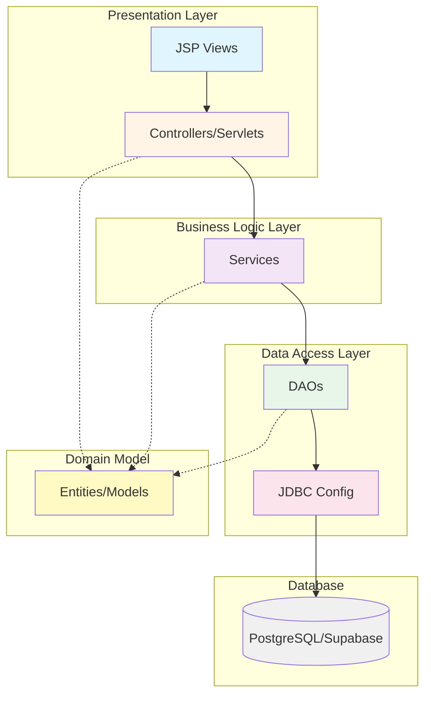

# UML Class Diagram - The Object Hour

## Architecture Overview

```mermaid
classDiagram
    %% ===== MODEL LAYER =====
    
    %% User Hierarchy (Inheritance)
    class User {
        <<abstract>>
        -Long id
        -String username
        -String passwordHash
        -String name
        -String role
        -LocalDateTime createdAt
        +User()
        +getters/setters()
        +toString() String
    }
    
    class Admin {
        +Admin()
        +canViewReports() boolean
        +canManageProducts() boolean
        +canManageUsers() boolean
    }
    
    class Customer {
        +Customer()
        +canShop() boolean
        +canCheckout() boolean
        +canViewOrders() boolean
    }
    
    User <|-- Admin : extends
    User <|-- Customer : extends
    
    %% Product
    class Product {
        -Long id
        -String name
        -String brand
        -String type
        -BigDecimal price
        -int stock
        -String description
        -String imageUrl
        -boolean isActive
        -LocalDateTime createdAt
        +Product()
        +getters/setters()
        +isAvailable() boolean
        +toString() String
    }
    
    %% Cart
    class Cart {
        -Long id
        -Long userId
        -boolean isActive
        -LocalDateTime createdAt
        -List~CartItem~ items
        +Cart()
        +getters/setters()
        +addItem(CartItem) void
        +getTotalItems() int
        +toString() String
    }
    
    class CartItem {
        -Long id
        -Long cartId
        -Long productId
        -int quantity
        -BigDecimal unitPrice
        -BigDecimal subtotal
        -Product product
        +CartItem()
        +getters/setters()
        +calculateSubtotal() void
        +toString() String
    }
    
    Cart "1" --> "*" CartItem : contains
    CartItem "*" --> "1" Product : references
    
    %% Order
    class Order {
        -Long id
        -Long userId
        -Long cartId
        -String paymentMethod
        -String status
        -BigDecimal totalAmount
        -LocalDateTime createdAt
        -LocalDateTime paidAt
        -List~OrderItem~ items
        -User user
        +Order()
        +getters/setters()
        +isPending() boolean
        +isPaid() boolean
        +isCancelled() boolean
        +markAsPaid() void
        +cancel() void
        +toString() String
    }
    
    class OrderItem {
        -Long id
        -Long orderId
        -Long productId
        -int quantity
        -BigDecimal unitPrice
        -BigDecimal subtotal
        -Product product
        +OrderItem()
        +getters/setters()
        +toString() String
    }
    
    Order "1" --> "*" OrderItem : contains
    OrderItem "*" --> "1" Product : references
    User "1" --> "*" Order : places
    
    %% Payment Methods (Inheritance)
    class PaymentMethod {
        <<abstract>>
        -String methodType
        +PaymentMethod()
        +processPayment(BigDecimal) boolean
        +getPaymentDetails() String
        +getters/setters()
    }
    
    class CashPayment {
        -String deliveryAddress
        -String contactPerson
        -String phoneNumber
        +CashPayment()
        +processPayment(BigDecimal) boolean
        +getPaymentDetails() String
        +getters/setters()
    }
    
    class BankTransferPayment {
        -String bankName
        -String accountNumber
        -String accountName
        +BankTransferPayment()
        +processPayment(BigDecimal) boolean
        +getPaymentDetails() String
        +getters/setters()
    }
    
    class EWalletPayment {
        -String walletProvider
        -String phoneNumber
        +EWalletPayment()
        +processPayment(BigDecimal) boolean
        +getPaymentDetails() String
        +getters/setters()
    }
    
    PaymentMethod <|-- CashPayment : extends
    PaymentMethod <|-- BankTransferPayment : extends
    PaymentMethod <|-- EWalletPayment : extends
    
    %% Report
    class ReportEntry {
        -String period
        -int totalOrders
        -BigDecimal totalRevenue
        -int totalProducts
        -int totalCustomers
        +ReportEntry()
        +getters/setters()
        +toString() String
    }
    
    %% ===== DAO LAYER =====
    
    class UserDAO {
        +findById(Long) User
        +findByUsername(String) User
        +findAll() List~User~
        +save(User) Long
        +update(User) boolean
        +delete(Long) boolean
        +authenticate(String, String) User
        -mapResultSetToUser(ResultSet) User
    }
    
    class ProductDAO {
        -ProductDAO productDAO
        +findById(Long) Product
        +findAllActive() List~Product~
        +findByType(String) List~Product~
        +findByBrand(String) List~Product~
        +search(String, String, BigDecimal, BigDecimal, Boolean) List~Product~
        +save(Product) Long
        +update(Product) boolean
        +delete(Long) boolean
        +updateStock(Long, int) boolean
        -mapResultSetToProduct(ResultSet) Product
    }
    
    class CartDAO {
        +findById(Long) Cart
        +findActiveCartByUserId(Long) Cart
        +createCart(Long) Long
        +deactivateCart(Long) boolean
        -mapResultSetToCart(ResultSet) Cart
    }
    
    class CartItemDAO {
        -ProductDAO productDAO
        +addItem(CartItem) Long
        +findById(Long) CartItem
        +findAllByCartId(Long) List~CartItem~
        +findByCartAndProduct(Long, Long) CartItem
        +updateItem(CartItem) boolean
        +updateQuantity(Long, int) boolean
        +deleteItem(Long) boolean
        +deleteAllByCartId(Long) boolean
        +getItemsCount(Long) int
        -mapResultSetToCartItem(ResultSet) CartItem
    }
    
    class OrderDAO {
        +createOrder(Order) Long
        +findById(Long) Order
        +findByUserId(Long) List~Order~
        +findAll() List~Order~
        +updateStatus(Long, String) boolean
        +updatePayment(Long, LocalDateTime) boolean
        -mapResultSetToOrder(ResultSet) Order
    }
    
    class OrderItemDAO {
        -ProductDAO productDAO
        +addItem(OrderItem) Long
        +findByOrderId(Long) List~OrderItem~
        -mapResultSetToOrderItem(ResultSet) OrderItem
    }
    
    %% ===== SERVICE LAYER =====
    
    class AuthService {
        -UserDAO userDAO
        +AuthService()
        +login(String, String) User
        +register(String, String, String, String) User
        +logout() void
        -hashPassword(String) String
        -verifyPassword(String, String) boolean
    }
    
    class ProductService {
        -ProductDAO productDAO
        +ProductService()
        +getAllActiveProducts() List~Product~
        +getProductById(Long) Product
        +getProductsByType(String) List~Product~
        +getProductsByBrand(String) List~Product~
        +searchProducts(String, String, BigDecimal, BigDecimal, Boolean) List~Product~
        +addProduct(Product) Long
        +updateProduct(Product) boolean
        +deleteProduct(Long) boolean
    }
    
    class CartService {
        -CartDAO cartDAO
        -CartItemDAO cartItemDAO
        -ProductDAO productDAO
        +CartService()
        +getOrCreateCart(Long) Cart
        +getCartWithItems(Long) Cart
        +addToCart(Long, Long, int) boolean
        +updateQuantity(Long, int) boolean
        +removeItem(Long) boolean
        +clearCart(Long) boolean
        +getCartTotal(Long) BigDecimal
        +getCartItemsCount(Long) int
        +validateCart(Long) boolean
    }
    
    class OrderService {
        -OrderDAO orderDAO
        -OrderItemDAO orderItemDAO
        -CartDAO cartDAO
        -CartItemDAO cartItemDAO
        -ProductDAO productDAO
        +OrderService()
        +createOrder(Long, String) Long
        +getOrderById(Long) Order
        +getOrdersByUserId(Long) List~Order~
        +getAllOrders() List~Order~
        +confirmPayment(Long) boolean
        +cancelOrder(Long) boolean
        -reduceProductStock(Long, int) boolean
    }
    
    class ReportService {
        -OrderDAO orderDAO
        -ProductDAO productDAO
        -UserDAO userDAO
        +ReportService()
        +generateDailyReport(LocalDate) ReportEntry
        +generateMonthlyReport(int, int) ReportEntry
        +generateYearlyReport(int) ReportEntry
        +getTopSellingProducts(int) List~Product~
        +getRevenueByPeriod(LocalDate, LocalDate) BigDecimal
    }
    
    %% ===== CONTROLLER LAYER =====
    
    class AuthController {
        <<servlet>>
        -AuthService authService
        +doGet(request, response) void
        +doPost(request, response) void
        -showLoginPage() void
        -showRegisterPage() void
        -processLogin() void
        -processRegister() void
        -processLogout() void
    }
    
    class ProductController {
        <<servlet>>
        -ProductService productService
        -CartService cartService
        +doGet(request, response) void
        +doPost(request, response) void
        -showProductList() void
        -showProductDetail() void
        -getUserId() Long
    }
    
    class CartController {
        <<servlet>>
        -CartService cartService
        +doGet(request, response) void
        +doPost(request, response) void
        -showCart() void
        -addToCart() void
        -updateQuantity() void
        -removeItem() void
        -clearCart() void
        -getUserId() Long
    }
    
    class OrderController {
        <<servlet>>
        -OrderService orderService
        +doGet(request, response) void
        +doPost(request, response) void
        -showOrders() void
        -showOrderDetail() void
        -createOrder() void
        -confirmPayment() void
        -getUserId() Long
    }
    
    class CheckoutController {
        <<servlet>>
        -OrderService orderService
        -CartService cartService
        +doGet(request, response) void
        +doPost(request, response) void
        -showCheckoutPage() void
        -processCheckout() void
        -getUserId() Long
    }
    
    class AdminProductController {
        <<servlet>>
        -ProductService productService
        +doGet(request, response) void
        +doPost(request, response) void
        -listProducts() void
        -showAddForm() void
        -showEditForm() void
        -addProduct() void
        -updateProduct() void
        -deleteProduct() void
    }
    
    class AdminReportController {
        <<servlet>>
        -ReportService reportService
        +doGet(request, response) void
        -showDailyReport() void
        -showMonthlyReport() void
        -showYearlyReport() void
    }
    
    %% ===== CONFIG LAYER =====
    
    class JDBC {
        <<utility>>
        -String DB_URL
        -String DB_USER
        -String DB_PASSWORD
        -String DB_DRIVER
        +getConnection() Connection
        +testConnection() boolean
        -loadDatabaseConfig() void
        -loadFromEnvironment() void
    }
    
    %% ===== RELATIONSHIPS BETWEEN LAYERS =====
    
    %% Controllers use Services
    AuthController --> AuthService : uses
    ProductController --> ProductService : uses
    ProductController --> CartService : uses
    CartController --> CartService : uses
    OrderController --> OrderService : uses
    CheckoutController --> OrderService : uses
    CheckoutController --> CartService : uses
    AdminProductController --> ProductService : uses
    AdminReportController --> ReportService : uses
    
    %% Services use DAOs
    AuthService --> UserDAO : uses
    ProductService --> ProductDAO : uses
    CartService --> CartDAO : uses
    CartService --> CartItemDAO : uses
    CartService --> ProductDAO : uses
    OrderService --> OrderDAO : uses
    OrderService --> OrderItemDAO : uses
    OrderService --> CartDAO : uses
    OrderService --> CartItemDAO : uses
    OrderService --> ProductDAO : uses
    ReportService --> OrderDAO : uses
    ReportService --> ProductDAO : uses
    ReportService --> UserDAO : uses
    
    %% DAOs use JDBC
    UserDAO ..> JDBC : uses
    ProductDAO ..> JDBC : uses
    CartDAO ..> JDBC : uses
    CartItemDAO ..> JDBC : uses
    OrderDAO ..> JDBC : uses
    OrderItemDAO ..> JDBC : uses
    
    %% DAOs work with Models
    UserDAO ..> User : manages
    ProductDAO ..> Product : manages
    CartDAO ..> Cart : manages
    CartItemDAO ..> CartItem : manages
    OrderDAO ..> Order : manages
    OrderItemDAO ..> OrderItem : manages
```

## Layer Architecture

## Package Structure

```mermaid
graph LR
    subgraph config
        JDBC_Config[JDBC]
    end
    
    subgraph model
        User_Model[User]
        Product_Model[Product]
        Cart_Model[Cart]
        Order_Model[Order]
        Payment_Model[PaymentMethod]
    end
    
    subgraph dao
        UserDAO_DAO[UserDAO]
        ProductDAO_DAO[ProductDAO]
        CartDAO_DAO[CartDAO]
        OrderDAO_DAO[OrderDAO]
    end
    
    subgraph service
        AuthService_Svc[AuthService]
        ProductService_Svc[ProductService]
        CartService_Svc[CartService]
        OrderService_Svc[OrderService]
        ReportService_Svc[ReportService]
    end
    
    subgraph controller
        AuthController_Ctrl[AuthController]
        ProductController_Ctrl[ProductController]
        CartController_Ctrl[CartController]
        OrderController_Ctrl[OrderController]
        AdminController_Ctrl[AdminControllers]
    end
    
    controller --> service
    service --> dao
    dao --> config
    dao -.-> model
    service -.-> model
    controller -.-> model
```

## Design Patterns Used

1. **MVC Pattern**: Separation of Model, View (JSP), and Controller
2. **DAO Pattern**: Data Access Object for database operations
3. **Service Layer Pattern**: Business logic separation
4. **Singleton Pattern**: JDBC connection management
5. **Factory Pattern**: Payment method creation
6. **Inheritance**: User hierarchy (Admin, Customer), PaymentMethod hierarchy

